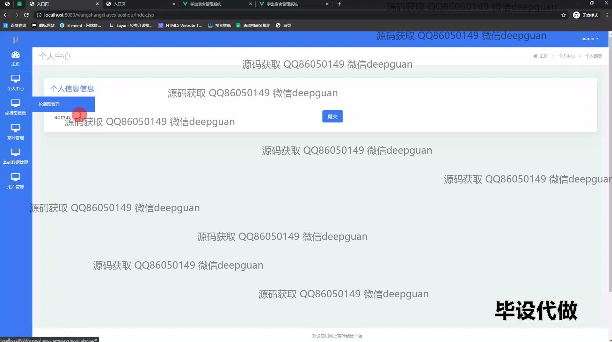
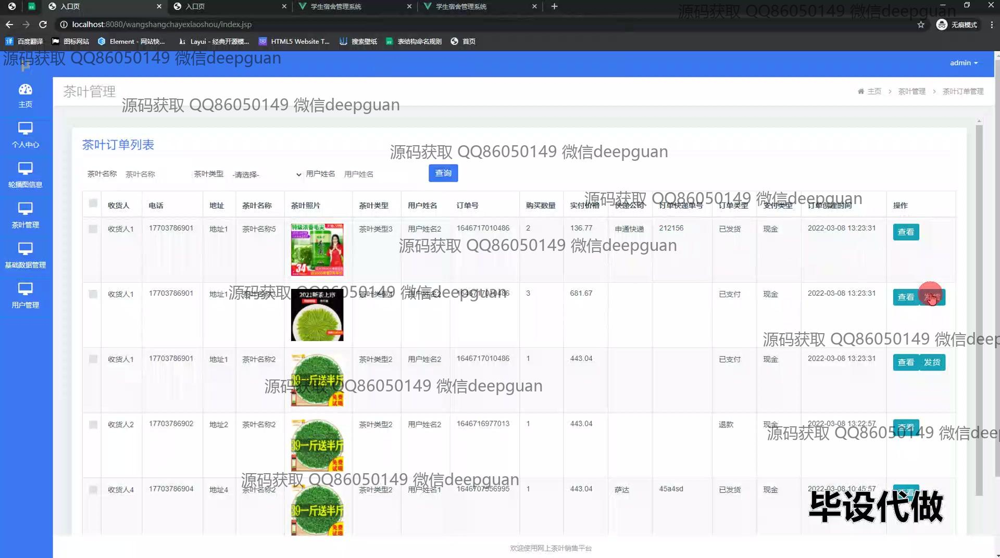

<h1 align="center">网上茶叶销售平台设计与开发+jsp</h1>

## 简介
网上茶叶销售平台：提供用户注册和登录、商品展示与购买、订单管理、用户信息管理、后台会员等级与茶叶管理等功能模块，实现全面的电商购物体验。    --计算机毕业设计源码；毕设源码；java毕业设计源码

## 联系方式

<h3 align="center">获取完整代码与数据库文件 + 微信：deepguan QQ: 86050149 QQ群: 783742310</h3>

<h3 align="center">可帮忙远程部署 包运行成功！提供远程部署、修改代码、设计文档指导、代码讲解等服务！</h3>

## 功能介绍（完整见运行截图）
管理员：登录、注册和退出功能。管理网站首页导航，包括茶叶展示与后台跳转。管理茶叶商品信息：包括名称、图片、库存、积分、价格、销售状态等，支持茶叶的查看、修改、删除及上下架操作。管理订单信息，包括订单查看、修改、退货与发货操作。管理用户信息，查看和修改用户数据，调整会员等级与折扣设置。管理会员等级系统，编辑会员类别与折扣信息，控制会员积分和升级。管理平台基本数据和图像轮播等内容。

用户：登录与注册界面，支持身份选择（普通用户或管理员）。浏览茶叶信息，支持搜索和筛选茶叶，查看商品详情、加入购物车或直接购买。查看个人订单信息，查询订单状态，进行查看或退款操作。管理个人信息与收货地址，支持添加、修改或删除地址。查看并编辑个人信息，在个人中心修改资料与查看历史订单。充值功能，选择支付方式如微信或支付宝进行账户充值。用户评价功能，对已购买的茶叶进行评分与评论。

## 运行截图

本代码来源于网络,仅供学习参考使用!

